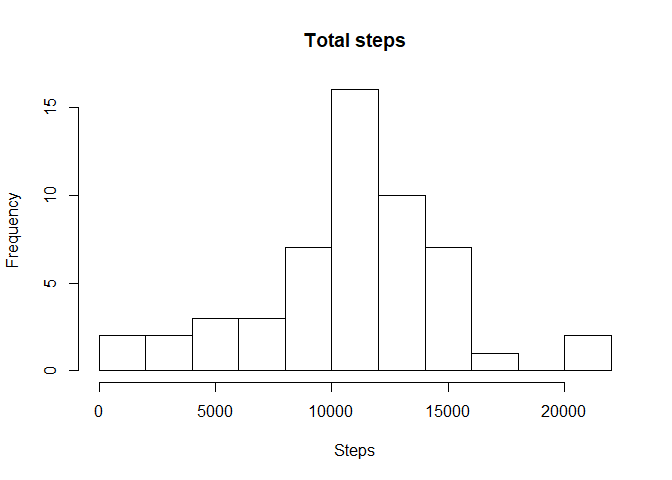
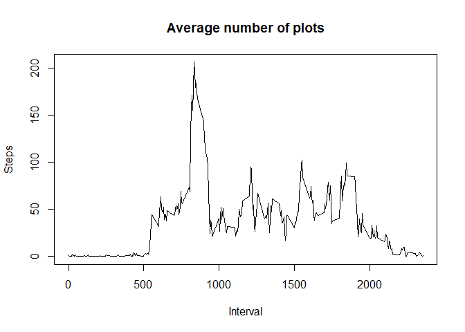
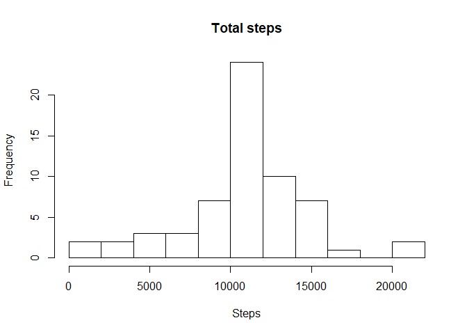
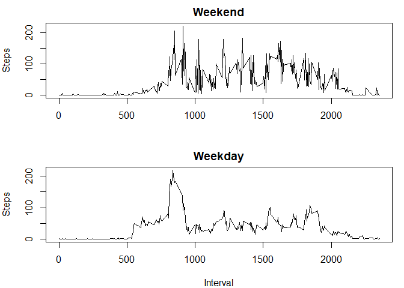

## Loading and preprocessing the data

```r
# create data folder if it does not exist
if (!file.exists("data")){
  dir.create("data")
}
#Read the file 
unzip(zipfile = "activity.zip", exdir = "./data")
activity <- read.csv("./data./activity.csv")
```


## What is mean total number of steps taken per day?

The mean toal number of steps taken per day is estimated after omitting the missing values in the data set as:


```r
activity2 <- na.omit(activity)
total_Steps <-  tapply(activity2$steps, activity2$date, sum)
```

Following plot shows the histogram of the total number of steps taken each day:


```r
hist(total_Steps, breaks = 9, xlab = "Steps", main = "Total steps")
```

<!-- -->


Mean and median is calculated and reported as follows:


```r
mean(total_Steps, na.rm = T) #mean
```

```
## [1] 10766.19
```

```r
median(total_Steps, na.rm = T) #median
```

```
## [1] 10765
```


## What is the average daily activity pattern?

Following figure shows the time series plot of average daily pattern:


```r
avg_steps <- tapply(activity2$steps, activity2$interval, mean)
plot(names(avg_steps), avg_steps, type = 'l', xlab = "Interval", ylab = "Steps", main = "Average number of plots")
```

<!-- -->

Identifying the 5 minute average with maximum number of steps:


```r
names(which.max(avg_steps))
```

```
## [1] "835"
```


## Imputing missing values

Total number of missing values are calculated as follows:


```r
sum(is.na(activity))
```

```
## [1] 2304
```

Missing values are replaced with mean for 5-minute interval and a new data set is created without any missing values:


```r
for (i in 1:nrow(activity))
{
  if (is.na(activity$steps[i] == T)) 
  {
    activity$steps[i] = avg_steps[as.character(activity$interval[i])]
    }
}
```

Histogram is plotted with the new dataset:


```r
total_Steps_na <- tapply(activity$steps, activity$date, sum)
hist(total_Steps_na, breaks = 9, xlab = "Steps", main = "Total steps")
```

<!-- -->

Mean and median is reported as follows: 


```r
mean(total_Steps, na.rm = T) # mean 
```

```
## [1] 10766.19
```

```r
median(total_Steps, na.rm = T) # median
```

```
## [1] 10765
```

It can be observed that mean and median are the same for both the data set.


## Are there differences in activity patterns between weekdays and weekends?


Segregating activities as weekend and weekday:


```r
activity$day <- weekdays(ymd(activity$date))
act_weekend <- filter(activity, activity$day == c("Saturday", "Sunday"))
act_weekday <- filter(activity, activity$day != c("Saturday", "Sunday"))
act_weekday <- with(act_weekday, tapply(steps, interval, mean))
act_weekend <- with(act_weekend, tapply(steps, interval, mean))
both  <- data.frame(cbind(act_weekday, act_weekend))
```

Weekend and weekday average 5 minute interval steps are plotted as follows: 


```r
par(mfrow = c(2,1) , mar = c(4,4,2,1))
plot(row.names(both), both[,2], type = 'l', main = "Weekend", xlab = "", ylab = "Steps")
plot(row.names(both), both[,1], type = 'l', main = "Weekday", xlab = "Interval", ylab = "Steps")
```

<!-- -->


